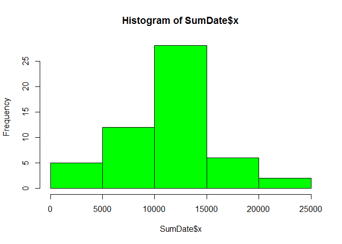
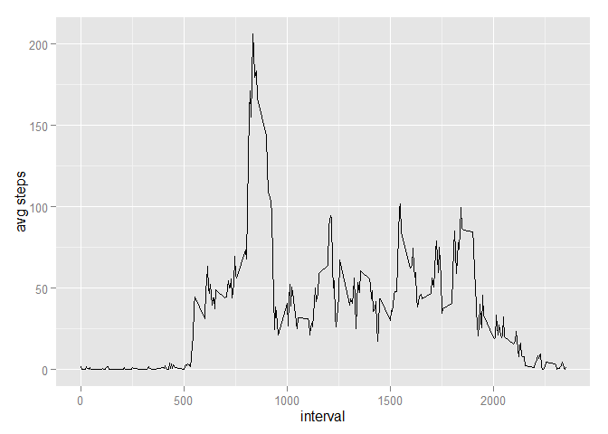
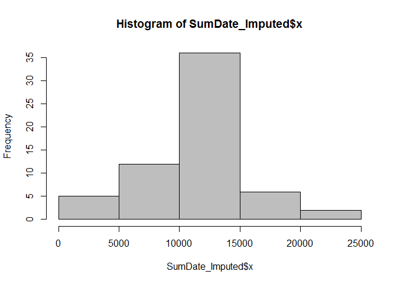
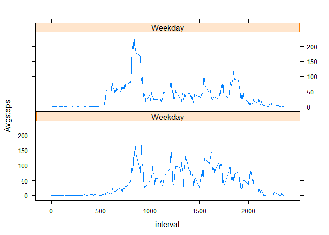

# Reproducible Research - Assignment
Vamsi  
December 16, 2015  

## Reading the input file and creating a file by unselecting the rows with missing values

```r
library(caret)
```

```
## Warning: package 'caret' was built under R version 3.1.3
```

```
## Loading required package: lattice
## Loading required package: ggplot2
```

```
## Warning: package 'ggplot2' was built under R version 3.1.3
```

```r
assignment = read.csv("activity.csv",header=TRUE)
missingvalues = is.na(assignment)
clean = subset(assignment,missingvalues == 'FALSE',select = steps:interval )
```
## Calculating Mean and median of Number of steps taken by daily

```r
SumDate <- aggregate(clean$steps,by = list(clean$date),FUN = sum)
mean(SumDate$x)
```

```
## [1] 10766.19
```

```r
median(SumDate$x)
```

```
## [1] 10765
```
## Plotting the histogram for the number of steps taken daily

```r
hist(SumDate$x,col ="green")
```

 
## Plotting the average number of steps vs. interval

```r
meanInterval = aggregate(clean$steps,by = list(clean$interval),FUN = mean)
qplot(meanInterval$Group.1,meanInterval$x,geom="line",xlab="interval",ylab="avg steps")
```

 
## Imputing missing values by calculating the average steps for different intervals

```r
test = assignment
for (i in 1:nrow(test)){
  t1<- test[i,]
  if(is.na(t1$steps) == TRUE){
    t2 = subset(meanInterval,meanInterval$Group.1==t1$interval)
  test$steps[i]=t2$x
}
}
```
## checking the mean and median of the number of steps taken daily after imputation

```r
SumDate_Imputed <- aggregate(test$steps,by = list(test$date),FUN = sum)
hist(SumDate_Imputed$x,col="gray")
```

 

```r
mean(SumDate_Imputed$x)
```

```
## [1] 10766.19
```

```r
median(SumDate_Imputed$x)
```

```
## [1] 10766.19
```
### After Imputation calculated Mean and Median values are similar to those before imputation
## Activity Patterns during Weekdays and Weekends

```r
test$date <- as.Date(test$date, format = "%Y-%m-%d")
test$weekdays <- weekdays(test$date)

for (i in 1:nrow(test)){
 
  if(test$weekdays[i] == "Sunday" || test$weekdays[i] == "Saturday" ){
 test$weekend[i] = 1
  }
  else{
    test$weekend[i] = 100
  }
}
join <- aggregate(test$steps,by = list(test$interval,test$weekend), FUN = mean)
colnames(join)=c("interval","Weekday","Avgsteps")
xyplot(Avgsteps ~ interval| Weekday, data=join, layout =c(1,2),type='l')
```

 

